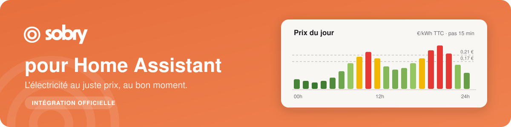

<div align="center">



<br><br>

[](https://github.com/hacs/integration)
[](https://www.home-assistant.io/)
[](https://github.com/Sobry-Energy/HACS-Sobry/releases)
[](LICENSE)
[](https://sobry.co)

</div>

---

## Sommaire

- [Présentation](#présentation)
- [Fonctionnalités](#-fonctionnalités)
- [Prérequis](#-prérequis)
- [Installation](#-installation)
- [Obtenir votre clé API](#-obtenir-votre-clé-api)
- [Configuration](#-configuration)
- [Entités créées](#-entités-créées)
- [Tester l'intégration](#tester-lintégration)
- [Niveau de prix (couleur)](#-niveau-de-prix-couleur)
- [Exemple d'automatisation](#-exemple-dautomatisation)
- [Gérer ou révoquer votre clé](#-gérer-ou-révoquer-votre-clé)
- [Dépannage](#-dépannage)

---

## Présentation

[Sobry](https://sobry.co) est un fournisseur d'électricité **dynamique** : le prix du kWh change **tous les quarts d'heure** en fonction du marché. Consommer au bon moment (lave-linge, recharge VE, ballon d'eau chaude…) fait baisser la facture — et c'est exactement là que Home Assistant devient utile.

Cette intégration **officielle** expose le prix de votre contrat, quart d'heure par quart d'heure, comme une entité Home Assistant. Vos automatisations peuvent utiliser ce prix. L'intégration ne commande aucun appareil par elle-même ; les couleurs indiquent des niveaux de prix, pas l'origine de l'électricité.

> Éditée par **Sobry (YENKA ENERGIE SAS)**. Elle utilise l'**API publique Sobry** (`api.sobry.co`) via une **clé API en lecture seule** que vous générez depuis votre espace client.

## ✨ Fonctionnalités

- 🔌 **Prix du quart d'heure courant**, en €/kWh **TTC**, pour la part variable de votre contrat. L'attribut `estimated` distingue une prévision d'un prix confirmé.
- 🗓️ **Prix à venir** : les prochaines heures sont exposées en attribut, prêtes pour vos graphiques et vos automatisations anticipées.
- 🎨 **Niveau de prix** par seuils (`vert` / `jaune` / `rouge`), **seuils réglables** ; le palier relatif de l'API Sobry reste disponible en complément.
- 🔐 **Lecture seule, moindre privilège** : la clé n'autorise que la lecture des prix de votre contrat. Elle ne peut **rien modifier** sur votre compte.
- 🏠 **Multi-contrat** : gérez plusieurs contrats (résidence principale, secondaire…), un par un.
- 🇫🇷 Interface en français (et anglais).

## 📦 Prérequis

- **Home Assistant** 2025.3 ou plus récent ; une version stable actuelle est recommandée.
- **[HACS](https://hacs.xyz/)** installé (recommandé pour l'installation et les mises à jour).
- Un **contrat Sobry actif**.
- Une **clé API** générée depuis votre espace client (voir plus bas — 2 minutes).

## 🔧 Installation

### Via HACS (recommandé)

Avant une mise à jour, créez une sauvegarde dans **Paramètres → Système → Sauvegardes**. Si Sobry est déjà installé, vérifiez dans HACS que son dépôt est bien **Sobry-Energy/HACS-Sobry**. Le dépôt communautaire `pierrepinon/sobry-hacs` utilise aussi le domaine `sobry` : les deux intégrations ne peuvent pas cohabiter. Ne remplacez pas l'une par l'autre dans une installation existante ; utilisez une instance de test distincte pour essayer l'officielle.

[](https://my.home-assistant.io/redirect/hacs_repository/?owner=Sobry-Energy&repository=HACS-Sobry&category=integration)

1. HACS → **Intégrations** → menu ⋮ → **Dépôts personnalisés**.
2. Ajoutez `https://github.com/Sobry-Energy/HACS-Sobry` — catégorie **Intégration**.
3. Cherchez **Sobry**, installez, puis **redémarrez Home Assistant**.

**Déjà installé depuis le dépôt officiel ?** Ouvrez **HACS → Sobry**, actualisez les informations du dépôt, puis installez la version **0.1.1** (ou utilisez **Retélécharger**, version 0.1.1). Redémarrez Home Assistant. Conservez l'entrée Sobry existante : son identifiant et celui du capteur restent inchangés.

### Manuelle

1. Téléchargez la dernière [release](https://github.com/Sobry-Energy/HACS-Sobry/releases).
2. Copiez le dossier `custom_components/sobry` dans le dossier `custom_components` de votre configuration Home Assistant.
3. Redémarrez Home Assistant.

## 🔑 Obtenir votre clé API

La clé se génère en libre-service depuis votre espace client Sobry :

1. Connectez-vous à **[app.sobry.co](https://app.sobry.co)**.
2. **Sélectionnez le contrat** concerné (sélecteur en haut de page).
3. Allez dans **Profil** → section **« Clé API / Accès développeur »**.
4. Cliquez sur **« Générer une clé »**.
5. **Copiez la clé** (elle commence par `sob_apikey_`) : ⚠️ elle n'est affichée **qu'une seule fois**, cochez « J'ai copié la clé » avant de fermer.

> **Bon à savoir**
> - **1 clé = 1 contrat.** Pour plusieurs contrats, répétez l'opération et créez une clé par contrat.
> - **Portée : lecture des prix uniquement** (`price:read`). La clé ne peut pas modifier votre contrat, vos coordonnées bancaires, ni vos factures.
> - **Validité : 1 an.** À l'approche de l'échéance, régénérez une clé et mettez-la à jour dans Home Assistant.
> - **Révocable à tout moment** depuis le même écran (bouton « Révoquer »), effet immédiat.
> - Une seule clé est active par contrat. **Régénérer une clé invalide celle des autres intégrations qui l'utilisent.** Réutilisez votre clé conservée pour ce test ; ne régénérez pas une clé déjà utilisée sans préparer sa mise à jour dans ces intégrations.

## 🧩 Configuration

[](https://my.home-assistant.io/redirect/config_flow_start/?domain=sobry)

1. **Paramètres** → **Appareils et services** → **Ajouter une intégration** → cherchez **Sobry**.
2. **Collez votre clé API** (`sob_apikey_…`) et validez.
3. L'intégration vérifie la clé, puis crée automatiquement l'appareil et son entité.

C'est tout — **rien d'autre à saisir** : la clé étant liée à un seul contrat, le contrat est reconnu automatiquement.

**Plusieurs contrats ?** Ajoutez à nouveau l'intégration avec chaque clé : chaque contrat apparaît comme un appareil distinct.

**Régler les seuils de couleur :** *Paramètres → Appareils et services → Sobry → **Configurer*** — ajustez le seuil **vert** (défaut `0,17 €/kWh`) et le seuil **rouge** (défaut `0,21 €/kWh`).

## 📊 Entités créées

Pour chaque contrat configuré (un appareil **Sobry**) :

| Entité | Exemple d'`entity_id` | Unité | Description |
|---|---|---|---|
| **Prix actuel** | `sensor.sobry_prix_actuel` | €/kWh | Prix TTC du quart d'heure en cours. |

**Attributs de `sensor.sobry_prix_actuel` :**

| Attribut | Description |
|---|---|
| `niveau` | Niveau de prix par seuils : `vert`, `jaune` ou `rouge`. |
| `couleur` | Code couleur hexadécimal du niveau (dégradé de vert sous le seuil vert). |
| `palier` | Palier **relatif** renvoyé par l'API Sobry : `GREEN`, `ORANGE`, `RED` ou `DARK_GREEN`. |
| `palier_couleur` | Code couleur hexadécimal du palier API. |
| `prix_a_venir` | Liste horodatée des prix des prochains créneaux (avec leur `niveau`). |
| `estimated` | `true` : le prix courant est une prévision ; `false` : prix confirmé. Chaque élément de `prix_a_venir` porte aussi ce champ. |

> **Rafraîchissement :** le prix est réévalué aux minutes 0, 15, 30 et 45. Les données manquantes ou estimées de demain sont réessayées tous les quarts d'heure à partir de 14 h, heure de Paris. Le cache évite les appels supplémentaires une fois les journées complètes et confirmées. Une panne réseau conserve un prix courant déjà reçu ; l'entité devient indisponible dès qu'aucun créneau fiable ne couvre l'instant présent.
>
> Les horodatages `debut` sont en UTC (`+00:00`). Home Assistant les convertit en heure locale pour l'affichage. Aux changements d'heure, une journée comporte 92 ou 100 quarts d'heure. L'API actuelle ne fournit pas d'offset : une heure d'hiver répétée incomplète ou dans un ordre inattendu est écartée pour éviter d'attribuer un prix au mauvais instant.

## Tester l'intégration

1. Installez **0.1.1**, redémarrez Home Assistant et configurez Sobry avec la clé du contrat choisi. Sur une installation officielle existante, conservez l'entrée et la clé déjà présentes.
2. Dans **Paramètres → Appareils et services → Sobry**, ouvrez l'appareil **Sobry**, puis son capteur **Prix actuel**. Il doit être disponible et afficher un nombre en **€/kWh**. Notez son identifiant réel : il peut porter un suffixe si plusieurs contrats existent.
3. Dans **Outils de développement → États**, sélectionnez ce capteur. Vérifiez `niveau`, `palier`, `prix_a_venir` et `estimated`. Comparez le prix à celui du **même contrat, du même quart d'heure et en TTC** dans l'espace Sobry. Une prévision (`estimated: true`) n'est pas un prix définitivement publié.
4. Repérez le prochain créneau dans `prix_a_venir`. Au passage à 00, 15, 30 ou 45, le capteur doit prendre son prix. Deux créneaux peuvent avoir le même prix : comparez aussi les données à venir, pas seulement un changement numérique.
5. Après 14 h, vérifiez l'apparition des prix du lendemain puis leur passage à `estimated: false` après publication. Leur absence avant publication est possible ; la récupération doit continuer tous les quarts d'heure.
6. Redémarrez Home Assistant : l'entrée et l'identifiant du capteur doivent être conservés. Dans **Paramètres → Système → Journaux**, vérifiez l'absence de `Platform sobry.sensor not found` et de `ModuleNotFoundError` pour Sobry.

**Premier essai sans action physique :** utilisez la notification de l'exemple ci-dessous. Validez d'abord les prix ; une recharge ou un chauffage demande ses propres contraintes et son repli.

**En cas d'échec :** vérifiez le dépôt et la version réellement installés, puis téléchargez les diagnostics depuis le menu de l'intégration. La clé y est masquée. Signalez la version de Home Assistant, celle de Sobry et l'heure du problème dans une issue. Si une mise à jour casse des automatisations existantes, désactivez celles qui dépendent du prix et restaurez la sauvegarde prise avant la mise à jour ; vérifiez le retour des anciens identifiants et de leur comportement. La restauration remet l'état sauvegardé, elle ne corrige pas un défaut déjà présent dans cet état.

## 🎨 Niveau de prix (couleur)

Chaque créneau reçoit un **niveau** selon son prix TTC, avec un **dégradé de vert** pour les prix bas :

| Niveau | Couleur | Prix (€/kWh TTC) |
|---|---|---|
| `vert` | 🟢 → 🟩 dégradé (plus foncé quand c'est moins cher, prix négatif inclus) | **≤ 0,17** |
| `jaune` | 🟨 | **0,17 – 0,21** |
| `rouge` | 🟥 | **> 0,21** |

Les **seuils sont réglables** dans les options de l'intégration (*Configurer*).

> En complément, l'attribut `palier` expose le code couleur **relatif** de l'API Sobry — les 6 h les moins / plus chères de la journée (`GREEN` / `ORANGE` / `RED` / `DARK_GREEN`) — identique à celui affiché dans l'app Sobry.

## 🤖 Exemple d'automatisation

Créer une notification lorsque le prix passe sous un seuil, sans commander d'appareil :

```yaml
automation:
  - alias: "Notification Sobry prix bas"
    trigger:
      - platform: numeric_state
        entity_id: sensor.sobry_prix_actuel
        below: 0.15          # €/kWh
    action:
      - action: persistent_notification.create
        data:
          title: "Prix Sobry bas"
          message: "Le prix du kWh vient de passer sous 0,15 € TTC."
```

Variante par **niveau** (créneaux verts) :

```yaml
    trigger:
      - platform: state
        entity_id: sensor.sobry_prix_actuel
        attribute: niveau
        to: "vert"
```

Vous pouvez aussi tracer la courbe des prix à venir avec [ApexCharts Card](https://github.com/RomRider/apexcharts-card) à partir de l'attribut `prix_a_venir`.

Le déclencheur `numeric_state` réagit au **franchissement** du seuil. Pour tester la notification immédiatement, utilisez **Exécuter les actions** dans l'éditeur d'automatisation ; ce bouton ne teste pas le franchissement du prix.


## 🔄 Gérer ou révoquer votre clé

Tout se passe dans votre espace client (**app.sobry.co → contrat → Profil → Clé API**) :

- **Régénérer** : crée une nouvelle clé et **révoque automatiquement l'ancienne**. Pensez à mettre à jour Home Assistant (l'intégration vous le proposera au prochain échec d'authentification).
- **Révoquer** : interdit immédiatement les nouveaux appels API. Home Assistant détecte le refus au prochain appel réseau, qui peut attendre le prochain changement de jour quand le cache est complet. Pour un test immédiat, rechargez l'intégration Sobry. L'entité devient alors `indisponible` et une demande de reconnexion apparaît.

## ❓ Dépannage

| Symptôme | Cause probable | Solution |
|---|---|---|
| L'entité est `indisponible` | Pas de prix exploitable pour le créneau courant, API inaccessible ou clé refusée | Consultez les journaux. En cas de clé refusée, suivez la demande de reconnexion avec une clé valide ; en cas de données manquantes, l'intégration réessaie. |
| « Clé invalide » à la configuration | Copier-coller incomplet | Recopiez la clé entière (préfixe `sob_apikey_` inclus). |
| Un seul contrat visible | 1 clé = 1 contrat | Créez une clé par contrat et ajoutez l'intégration autant de fois. |

Un problème persistant ? Ouvrez une [issue](https://github.com/Sobry-Energy/HACS-Sobry/issues) (sans jamais y coller votre clé).


## 🧰 Développement

```bash
git clone https://github.com/Sobry-Energy/HACS-Sobry.git
cd HACS-Sobry
# Python 3.14 pour les tests sur Home Assistant 2026.9.1
python -m venv .venv
. .venv/bin/activate
pip install -r requirements_test.txt
pytest -q
```

Les tests chargent Home Assistant et l'intégration réels avec une API simulée. Ils couvrent configuration, capteur, quarts d'heure, minuit, changements d'heure, cache, erreurs et reconnexion. Ils ne remplacent pas la recette ci-dessus avec un contrat réel.


## 📄 Licence

Distribué sous licence [MIT](LICENSE). © 2026 YENKA ENERGIE SAS (Sobry).

## 🙏 Remerciements

Merci à la communauté Home Assistant francophone pour ses retours et ses idées.

---

<div align="center">
<sub>Fait avec ⚡ par <a href="https://sobry.co">Sobry</a> — l'électricité au juste prix, au bon moment.</sub>
</div>
